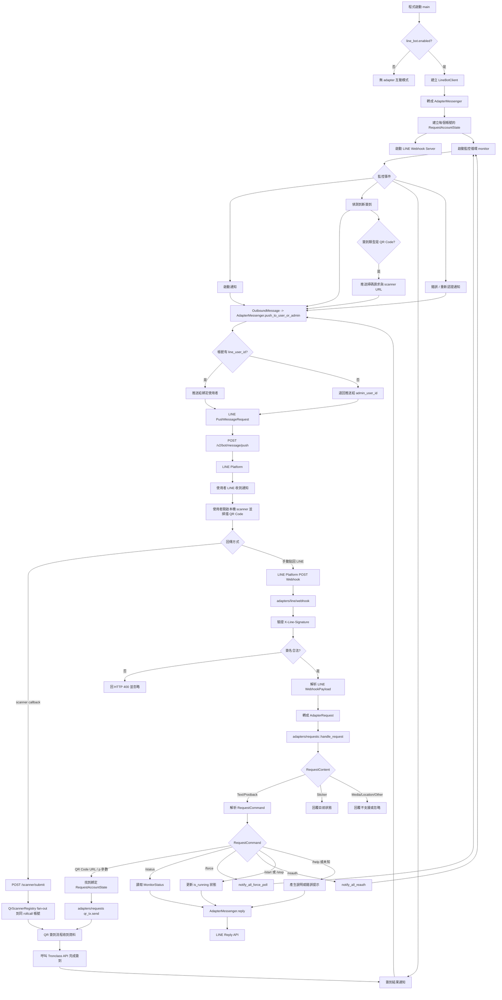

# Tronclass Rollcall

Tronclass Rollcall 是一個以 Rust 撰寫的 Tronclass 自動簽到工具，支援數字、雷達與 QR Code 簽到，並可透過 Line Bot Webhook 進行狀態查詢、暫停、啟動、強制檢查與 QR Code 回傳。它也支援多帳號監控，適合需要長時間輪詢不同 Tronclass provider 的場景。

> [!CAUTION]
> 本專案僅供教學與研究用途。請遵守學校規範、平台服務條款與當地法律。維護者與貢獻者不對濫用、帳號處置、法律風險或其他後果負責，使用者需自行承擔責任。

## Features 功能

- [x] 支援多 provider 設定：目前內建 `tronclass`、`fju`、`tku` 類型。
- [x] 支援多帳號：帳號儲存在 SQLite `accounts.db`，可用 CLI 新增、停用、啟用與刪除。
- [x] 自動輪詢 `/api/radar/rollcalls`，偵測需要處理的簽到項目。
- [x] 數字簽到：嘗試 `0000` 到 `9999`，支援並發、請求延遲與動態失敗冷卻。
- [x] 雷達簽到：使用預設座標嘗試簽到，並可依距離回應推估候選位置。
- [x] QR Code 簽到：可解析掃描 URL 或 `p` 參數，並呼叫 Tronclass QR Code 簽到 API。
- [x] Line Bot 整合：可推播簽到通知，並支援 `/status`、貼圖查狀態、`/start`、`/stop`、`/force`、`/reauth`、`/help`。
- [x] Line 使用者自助查詢：非管理員若已在帳號資料中綁定 `line_user_id`，可透過 `/status` 或傳送貼圖查詢自己的 Tronclass 帳號狀態。
- [x] 帳號專屬通知：該帳號的簽到事件、QR Code 掃碼需求、簽到結果，以及啟動/重認證等系統通知，會優先推送到該帳號綁定的 `line_user_id`；若未綁定則退回管理員。
- [x] 設定驗證：可用 `--validate` 檢查 `config.toml` 與帳號資料庫。
- [x] 日誌支援：可透過 `config.logging.level` 或 `RUST_LOG` 控制輸出等級。

## Installation 安裝指南

### 方法一：使用 Bundled 套件

目前尚未提供預先編譯套件。請先使用 Build from Source。

### 方法二：Docker

目前尚未提供 Docker image 或 compose 範例。

### 方法三：Build from Source

請先安裝 [Rust](https://rust-lang.org/tools/install/)。

```sh
git clone https://github.com/kami-sqmf/tronclass_rollcall.git
cd tronclass_rollcall
cargo build --release
```

編譯完成後可用：

```sh
./target/release/tronclass_rollcall --help
```

開發期間也可以直接執行：

```sh
cargo run -- --help
```

## Guide 使用指南

### 1. 產生設定檔

```sh
cargo run -- init
```

預設會建立 `config/config.toml`。如果檔案已存在，可使用：

```sh
cargo run -- init --force
```

### 2. 編輯 `config/config.toml`

Provider 設定範例：

```toml
[providers.fju]
kind = "fju"
base_url = "https://elearn2.fju.edu.tw"

[providers.fju.api]
base_url = "https://elearn2.fju.edu.tw"
poll_interval_secs = 10
request_timeout_secs = 30

[providers.fju.schedule]
periods = ["07:10~17:30"]
rest_weekdays = ["sun"]
```

數字簽到設定：

```toml
[providers.fju.brute_force]
concurrency = 200
request_delay_ms = 0
transient_failure_threshold = 50
transient_failure_ratio = 0.20
cooldown_secs = 10
max_cooldowns = 3
min_concurrency = 10
```

欄位說明：

- `concurrency`：數字簽到同時嘗試的請求數。
- `request_delay_ms`：每個嘗試送出前的延遲毫秒數。
- `transient_failure_threshold`：自上次冷卻後，暫時性異常失敗累積多少次會觸發保護。
- `transient_failure_ratio`：單批暫時性異常失敗比例達到多少會觸發保護。
- `cooldown_secs`：觸發保護後暫停幾秒。
- `max_cooldowns`：最多冷卻幾次；用完後仍達門檻會宣告失敗。
- `min_concurrency`：動態降速後允許的最低並發。

課堂時段設定：

- `providers.<name>.schedule.periods`：以 `HH:MM~HH:MM` 字串定義允許自動輪詢的時間區段。
- 例如 `periods = ["07:10~17:30"]` 代表每天只在 07:10 到 17:30 之間輪詢。
- 如果之後需要多段時間，也可以寫成 `periods = ["07:10~12:00", "13:40~17:30"]`。
- `rest_weekdays`：休息日，例如 `["sun"]` 代表星期日不輪詢。

時區設定：

```toml
[time]
timezone = "Asia/Taipei"
```

- `time.timezone` 可設為 `local`、`UTC`，或像 `Asia/Taipei` 這種 IANA 時區名稱。
- 課堂時段判斷與 log timestamp 會共用這個時區設定。

> [!NOTE]
> `kind = "fju"` 且未自行覆蓋 `schedule` 時，會自動套用 `periods = ["07:10~17:30"]` 與 `rest_weekdays = ["sun"]`。

> [!NOTE]
> `400` / `422` 代表數字錯誤，是正常嘗試流程，不會計入異常失敗。`429`、`408`、`5xx`、timeout、connect error 與非預期狀態會計入暫時性失敗。

### 3. 新增帳號

帳號資料預設儲存在 `config/accounts.db`。

```sh
cargo run -- account add my-account \
  --provider fju \
  --username "student_id" \
  --password "password"
```

常用帳號指令：

```sh
cargo run -- account list
cargo run -- account show my-account
cargo run -- account disable my-account
cargo run -- account enable my-account
cargo run -- account remove my-account
```

如果要指定帳號資料庫路徑：

```sh
cargo run -- -a ./config/accounts.db account list
```

### 4. 驗證設定

```sh
cargo run -- --validate
```

也可以指定設定檔與帳號資料庫：

```sh
cargo run -- -c config/config.toml -a config/accounts.db --validate
```

### 5. 啟動監控

```sh
cargo run --release
```

或使用編譯後的 binary：

```sh
./target/release/tronclass_rollcall
```

啟動後程式會：

1. 載入 `config/config.toml`。
2. 開啟 `config/accounts.db`。
3. 登入啟用中的帳號。
4. 依 `poll_interval_secs` 輪詢簽到列表。
5. 依簽到類型分派到數字、雷達或 QR Code 模組處理。

### Line Bot Webhook

啟用 Line Bot：

```toml
[adapters.line_bot]
enabled = true
channel_secret = "your_line_channel_secret"
channel_access_token = "your_line_channel_access_token"
webhook_port = 8080
webhook_path = "/webhook"
public_base_url = "https://your-webhook-domain.example"
admin_user_id = "Uxxxxxxxxxxxxxxxxxxxxxxxxxxxxxxxx"
```

可用指令：

```text
/status  查看目前監控狀態
/start   啟動簽到監控
/stop    暫停簽到監控
/force   立即觸發一次簽到檢查
/reauth  重新登入
/help    顯示說明
```

QR Code 簽到時，若設定 `public_base_url`，通知中的「開啟掃碼頁」會開啟本機 scanner，掃描結果會直接 POST 回 webhook server，並套用到同一個 provider + rollcall ID 中所有等待 QR Code 的帳號；因此同一堂課多帳號只需要一個人掃一次。若未設定 `public_base_url`，仍可直接把掃描到的 URL 或 `p` 參數貼給 Bot。

管理員可查詢所有帳號狀態，並可使用 `/start`、`/stop`、`/force`、`/reauth` 控制全部監控帳號。非管理員只能透過 `/status` 或傳送貼圖查詢自己 `line_user_id` 綁定的 Tronclass 帳號狀態；控制指令仍限管理員使用。當系統偵測到綁定帳號需要簽到時，開始通知、QR Code 掃碼請求與簽到結果會優先推送到該 `line_user_id`，未綁定才會退回管理員；帳號啟動、重新認證成功或失敗等系統通知也走同樣規則。Webhook 只處理個人對話來源的訊息與 postback，群組或多人聊天室事件會被忽略。

### Adapter 雙向互動訊息流程

訊息互動分成兩條主線：系統透過 adapter 主動推送通知，以及使用者透過 adapter webhook 回傳指令或 QR Code。`adapters/line` 只負責 LINE API、Webhook 入口與 payload 轉換；`adapters/events` 定義 adapter-neutral 的對外事件內容，讓各 adapter 自行渲染成文字、按鈕或 template；`adapters/requests` 處理 adapter 傳回來的使用者請求、權限、狀態查詢與 QR Code 等待輸入通道。



關鍵介面：

- `OutboundMessage`：核心流程產生的語意化傳送內容；adapter 可自行渲染成文字、按鈕、template 或 embed。
- `AdapterMessenger`：adapter-neutral 的訊息發送介面，提供 reply、push 與 user/admin fallback。
- `RequestState` / `RequestAccountState`：串接 adapter 使用者、帳號狀態、監控控制信號與 request channels。
- `AdapterRequest` / `RequestContent`：各 adapter 的 webhook payload 轉換成共用請求後交給 `adapters/requests`。
- `QrScannerRegistry`：管理本機 scanner 的一次性 token，並把同一 provider + rollcall ID 的 QR Code 掃描結果廣播到所有等待帳號。
- `adapters/requests::qr_tx.send(qr_data)`：使用者回傳 QR Code 後，交給等待中的 QR Code 簽到流程。


### 自行新增校園 Provider

新增 provider 時通常需要修改：

- `src/config.rs`：新增或調整 `ProviderKind`。
- `src/auth/providers/mod.rs`：註冊 provider 與對應的 auth flow。
- `src/auth/providers/<provider_name>.rs`：實作登入流程。
- `config/config.toml.example`：補上 provider 設定範例。

Provider 名稱必須和帳號新增時的 `--provider` 對應。

## Project Structure 專案結構

```text
config/
├── config.toml.example   # 系統設定範例
├── config.toml           # 本機系統設定，不建議提交
└── accounts.db           # SQLite 帳號資料庫，不建議提交
src/
├── main.rs               # CLI、啟動流程與 graceful shutdown
├── account.rs            # 帳號設定解析
├── config.rs             # 設定管理與驗證
├── db.rs                 # SQLite 帳號資料庫
├── monitor.rs            # 主監控循環
├── api/
│   ├── mod.rs            # HTTP client 與通用 API 錯誤
│   ├── profile.rs        # 使用者資訊 API
│   └── rollcall.rs       # 簽到 API
├── auth/
│   ├── mod.rs            # 認證主邏輯
│   └── providers/
│       ├── mod.rs        # Provider 註冊與分派
│       └── <school>.rs   # 各校登入流程
├── adapters/
│   ├── mod.rs            # Adapter 模組註冊
│   ├── events.rs         # 共用事件、指令、權限、狀態與監控控制
│   ├── requests.rs       # 共用參數詢問/輸入通道（目前含 QR Code）
│   └── line/
│       ├── mod.rs        # LINE adapter 模組註冊
│       ├── client.rs     # LINE Messaging API client 與簽名驗證
│       ├── webhook.rs    # LINE Webhook 入口與事件轉換
│       └── types.rs      # LINE wire types
└── rollcalls/
    ├── mod.rs            # 簽到調度中心
    ├── number.rs         # 數字簽到與動態失敗控制
    ├── qrcode.rs         # QR Code 解析與簽到
    └── radar.rs          # 雷達簽到與座標推估
```

## Security 注意事項

- 不要提交 `config/config.toml`、`config/accounts.db`、Line token、密碼或 session cookie。
- `accounts.db` 內含登入帳密，請自行保護檔案權限。
- 若使用 Line Bot，請確認 webhook endpoint 只暴露在可信任的網路環境，並正確設定 `channel_secret`。
- 高並發數字簽到可能觸發平台限制；建議依實際環境調整 `concurrency` 與動態冷卻參數。

## Contributing 貢獻

歡迎提交 Issues、Pull Requests 或 Fork。

1. 新增學校 provider：請新增 `src/auth/providers/<your-school>.rs`，並更新 provider 註冊與設定範例。
2. 回報問題：請在 GitHub Issues 描述重現方式、設定摘要與錯誤日誌。
3. 新增 adapter：可參考 `src/adapters/line` 實作其他通知或 webhook 整合。

## License

[](https://github.com/kami-sqmf/tronclass_rollcall/blob/master/LICENSE)

歡迎自由使用、修改這份程式碼，也歡迎基於它進行開發。若您將其用於公開或商業專案，若能標註來源，我會非常感謝。

## Credits

- [seven-317/Tronclass-API](https://github.com/seven-317/Tronclass-API)
- [KrsMt-0113/XMU-Rollcall-Bot](https://github.com/KrsMt-0113/XMU-Rollcall-Bot)
